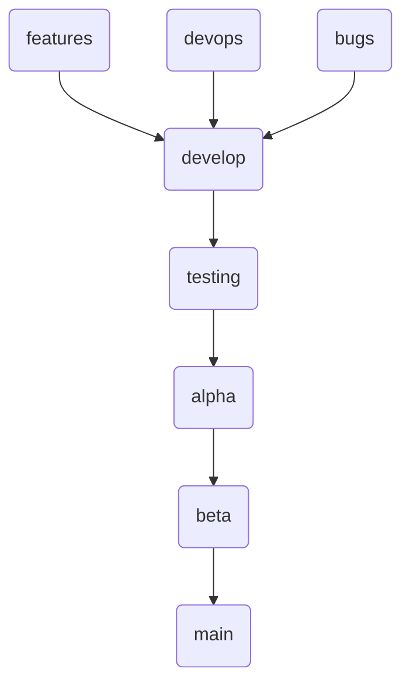

# Github Actions

Github actions exploration

# Git strategy

## Branches

- `devops` - For devops feature
- `bugs` - For bug fixes

- `develop` - The default branch
- `testing` - internal testing
- `alpha` - closed testing
- `beta` - open testing
- `main` - production

## Branching Strategy

- All development to be done based out of `develop` branch.
- PR to be raised to `feature branches` on completion of development.
- `feature branches` -> `develop` - on completion of feature.
- `develop` -> `testing` - when testing is required
- `testing` -> `alpha` - when alpha deployent is required
- `alpha` -> `beta` - when beta deployent is required
- `beta` -> `main` - when production deployent is required

# Devops

### Push and PR to develop and devops

- Build
- Run tests
- Upload **debug** APK files

### Push and PR to testing

- Build
- Run tests
- Upload **debug** APK files
- Deploy to _Firebase app distribution_ or _Internal testing track_.

### Push and PR to alpha

- Build
- Run tests
- Upload **signed** APK files
- Deploy to **aplha** track.

### Push and PR to beta

- Build
- Run tests
- Upload **signed** APK files
- Deploy to **beta** track.

### Push and PR to main

- Build
- Run tests
- Upload **signed** APK files
- Deploy to **production** track.
